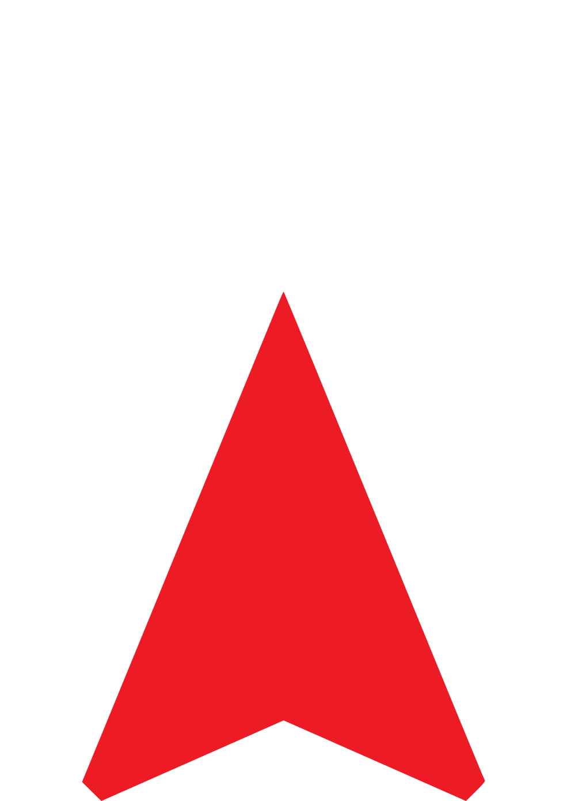

<br/>



<br/><br/><br/>

## x-track \\ foxsys-xyz
The flight tracker for foxsys-xyz. Still a work in progress.

## Installation

This application requires electron & react for a build as minimum. Obviously, you should have yarn or npm installed for the node dependencies.

Install the dependencies and devDependencies and start the server.

```sh
$ cd x-track
$ yarn install
$ cp .env.example .env
$ yarn dev
```

For production environments.

```sh
$ yarn dist
```
